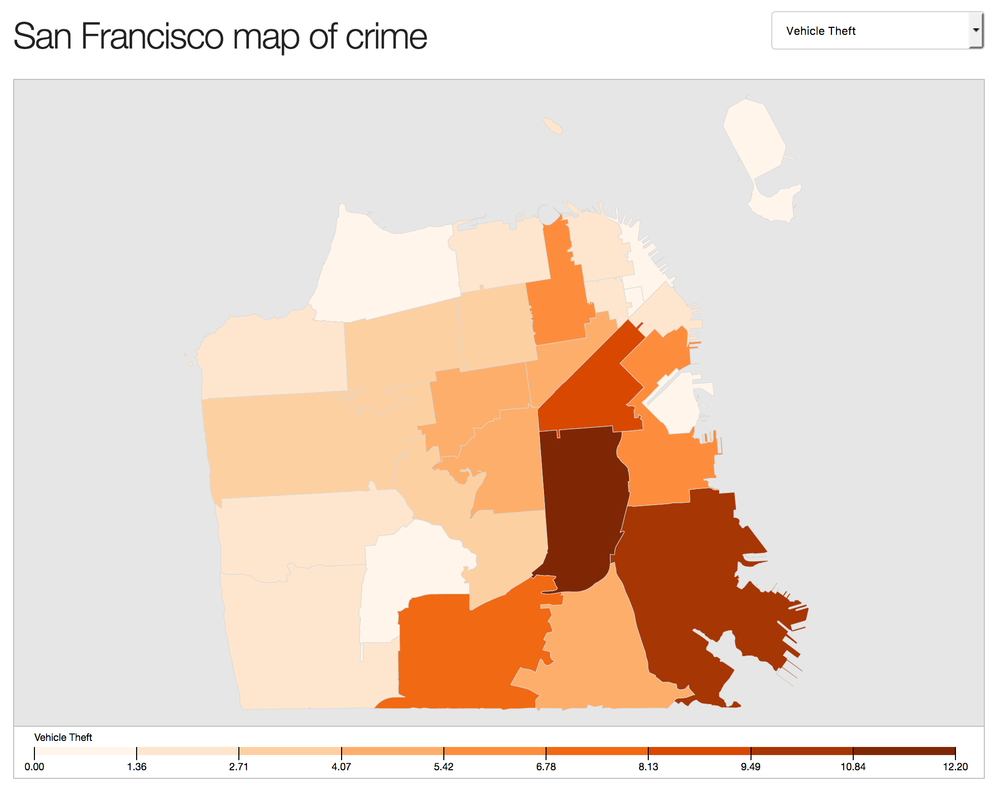

# Classifying Crime in San Francisco

In this repo is data I downloaded from a variety of sources in an attempt to classify the type of San Francisco crime incidents based on the location and time of day a crime occurred.

### Data collected 

1. Police incidents recorded between Jan 2016 and April 2017 (category, description,
location, police district, date, time)  
a. Assault, shoplifting, theft from cars, drugs, vandalism, robbery, vehicle theft, theft of
property  
2. Geospatial data of Zip code boundaries  
3. Zillow house price data  
4. Bart and Caltrain station locations  
5. Police station locations  
6. Medical marijuana dispensary locations  
7. Health care facility locations  
8. Homeless shelter locations  

### Feature engineering on data collected

1. Zip code in which each incident occurred  
2. Average house price, median income level and population density in each
zip code  
3. Distance to Union Square  
4. Distance to nearest police station, train station, medical marijuana
dispensary, healthcare facility, homeless shelter  
5. Total number of nearby medical marijuana dispensaries, train stations,
health care facilities, homeless shelters  

### Final Model: Bagging Classifier (n=300)

Classification | Precision | Recall | F1
---------------|-----------|--------|---
Assault | 0.42 | 0.48 | 0.45
Shoplifting | 0.50 | 0.47 | 0.48
Theft from auto | 0.57 | 0.71 | 0.63
Drugs/narcotic | 0.55 | 0.50 | 0.52
Vandalism | 0.21 | 0.14 | 0.17
Robbery | 0.15 | 0.09 | 0.11
Vehicle theft | 0.33 | 0.25 | 0.28
Theft of property | 0.31 | 0.22 | 0.26
**Avg / total** | **0.43** | **0.46** | **0.44**

### Visualization of Data

Inside the repo is a D3 visualization of the data contained within a Flask app.

